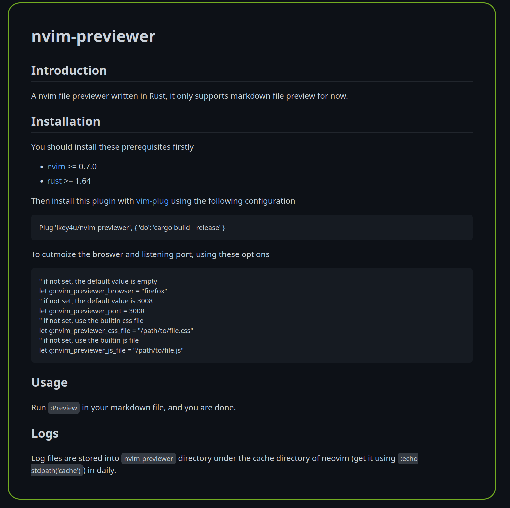
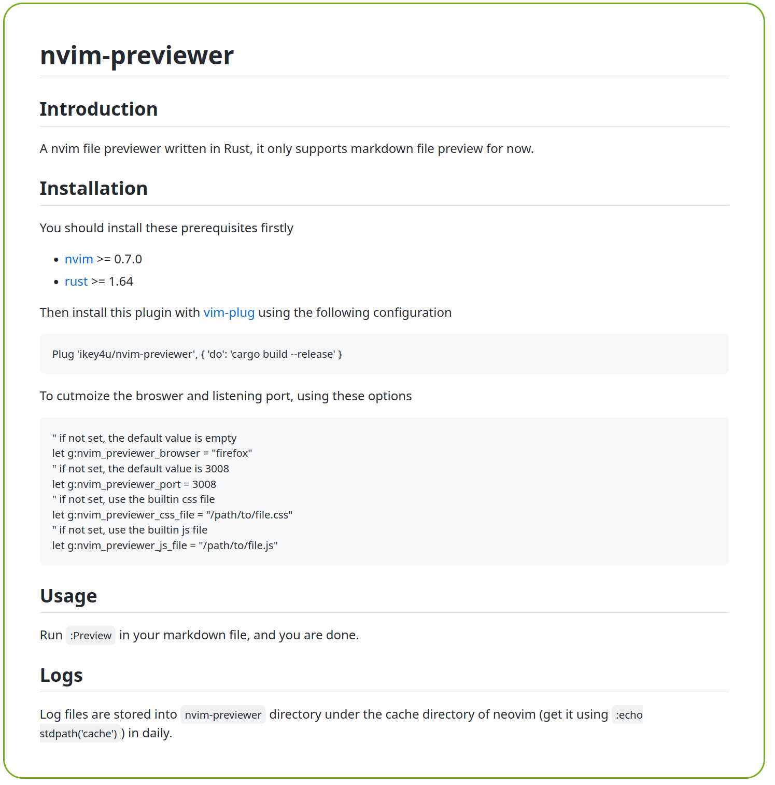

# nvim-previewer

## Introduction

A nvim file previewer written in Rust, it only supports markdown file preview for now.

## Installation

You should install these prerequisites firstly

- [nvim](https://neovim.io/) >= 0.7.0
- [rust](https://www.rust-lang.org/tools/install) >= 1.64

Then install this plugin with [vim-plug](https://github.com/junegunn/vim-plug) using the following
configuration

    Plug 'ikey4u/nvim-previewer', { 'do': 'cargo build --release' }

To cutmoize the broswer and listening port, using these options

    " if not set, the default value is empty
    let g:nvim_previewer_browser = "firefox"
    " if not set, the default value is 3008
    let g:nvim_previewer_port = 3008
    " if not set, use the builtin css file
    let g:nvim_previewer_css_file = "/path/to/file.css"
    " if not set, use the builtin js file
    let g:nvim_previewer_js_file = "/path/to/file.js"

## Usage

Run `:Preview` in your markdown file, and you are done.

Note that nvim-previewer supports exporting markdown to latex source, and compile the latex source
to PDF document (depends on latex).

To compile the latex source to PDF file, you should install [texlive](https://www.tug.org/texlive/)
and [rsvg-convert](https://gitlab.gnome.org/GNOME/librsvg). If you have cargo installed, you can
install rsvg-convert using the following command

    cargo install --git https://gitlab.gnome.org/GNOME/librsvg.git --tag 2.55.90

If you just want to get the latex source, then texlive and rsvg-convert are not required.

## Logs

Log files are stored into `nvim-previewer` directory under the cache directory of neovim (get it
using `:echo stdpath('cache')`) in daily.

# Screenshots

