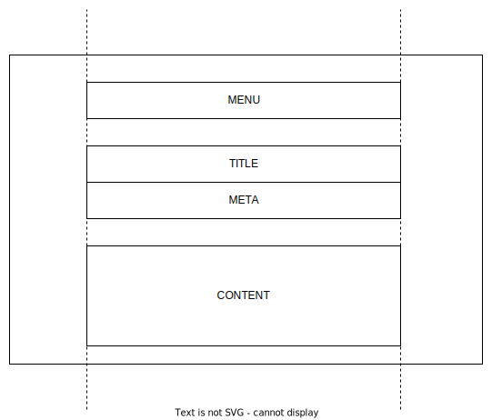

# nvim-previewer plugin

## Design Principles

- Page Layout

    Page max width is set to 677px, and the layout is given as following

    

- Font Size

    - h1: 20px, should be only used in `TITLE`

    - h2, h3: 18px, should be only used in `CONTENT`

    - h3 ... h6: Avoid to use

    - p, ul, li, a, blockquote, pre, code: 14px

- Font Famliy

        font-family:
            -apple-system-font,
            BlinkMacSystemFont,
            Helvetica Neue,
            PingFang SC,
            Hiragino Sans GB,
            Microsoft YaHei UI,
            Microsoft YaHei,
            Arial,
            sans-serif;

- Image

    Border with raidus 25px and shadow

        0px 8px 24px 0px rgba(140, 149, 159, 0.2)
